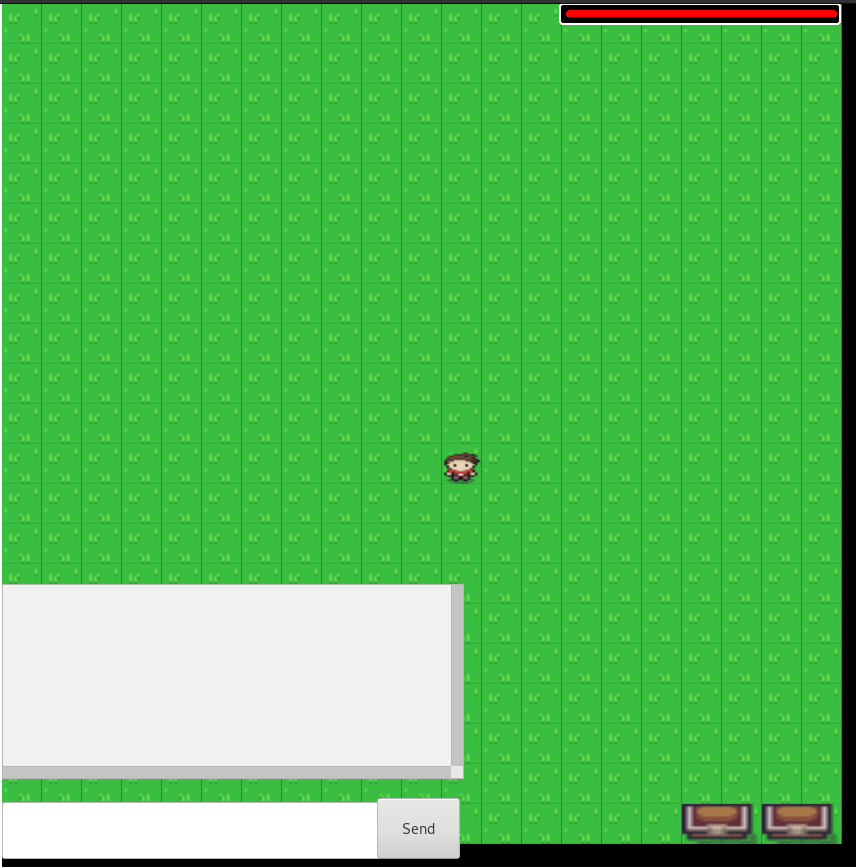

# AberWebMUD
AberWebMUD is a university (Aberystwyth) final year Major Project.
Designed to be a MUD (themes and gameplay to be decided) thats main
focus is to be easy to play and available online without the need for
special clients.

## Build info, references, and licenses
Created with Python 3.6.0 and packaged with:
* [Pixi.js v4.3.5 and  4.3.4 (MIT License)](http://www.pixijs.com/)
* [SocketIO 1.4.5 (MIT License)](http://socket.io/)
* [jQuery 3.1.1 (MIT License)](https://jquery.com/)
* [QUnit 2.2.1 (JS Foundation License)](http://qunitjs.com/)
* ["Zelda-like tilesets and sprites" by ArMM1998 (CC0 1.0)](http://opengameart.org/content/zelda-like-tilesets-and-sprites)

Other technologies used:
* [Flask 0.12 (BSD License)](http://flask.pocoo.org/)
* [Flask-SocketIO 2.8.3 (MIT License)](https://github.com/miguelgrinberg/Flask-SocketIO)
* [PostgreSQL](https://www.postgresql.org/)
* [SQLite](https://sqlite.org/)
* [PonyORM 0.7.1 (Apache License V2.0)](https://docs.ponyorm.com/)
* [Webpack JavaScript Module Bundler](https://webpack.js.org/)
* ["Leshy SpriteSheet Tool - Online Sprite Sheet, Texture Atlas Packer"](https://www.leshylabs.com/apps/sstool/)

Check the requirements.txt for dependancy version details
Check the LICENSE file for the project's license

[-brightgreen.svg)](https://www.pylint.org/)

## Building the project
The frontend is build using Webpack, you will need it/npm installed to build it 

### Frontend

To build both client and test code:
1. Change terminal directory to `server/js-files`
2. run `npm run build` 

Testing:
* If you've already built the client and test code, you can then run the JS tests with 'npx karma start' to test what parts of the client have been covered.
* Otherwise you can just use `npm test` to build and run just the test code (and any included/tested client code)

Output:
Webpack will create:
* static/main.js -- Main Client code bundle (served up as part of the main application webpage from Flask)
* static/tests.js -- Test Code, currently just ran using.
* *.js.map files  -- Source Maps for the client/test code to facilitate debugging in-browser.

## Backend / Running the server
1. You first need to satisfy python's dependencies, run 'sudo pip install -r requirements.txt' in the AberWebMUD/root folder
2. Change your terminal directory to the server folder
5. Run main.py in Python
6. visit 'localhost:5000' in a browser

## Postgres vs SQLite
The project currently uses an SQLite DB in-memory in order to run locally for development and demonstration.
The project can also be run with a PostgreSQL database for a scalable DB platform if deployed (adjusted in database.py), if so you must ensure the PostgreSQL database service
is running (database.py should detail what is expected).

## Running client tests (QUnit)
1. (Optional) Client tests (files named 'test-....js') are appended into the test.js file using the same build.sh as above
2. Client tests are available once the server is running (main.py) at 'localhost:5000/test'

## Running server tests (unittest)
1. change directory to 'server'
2. Run: 'python -m unittest discover' OR 'python -m unittest discover tests "*.py"'
